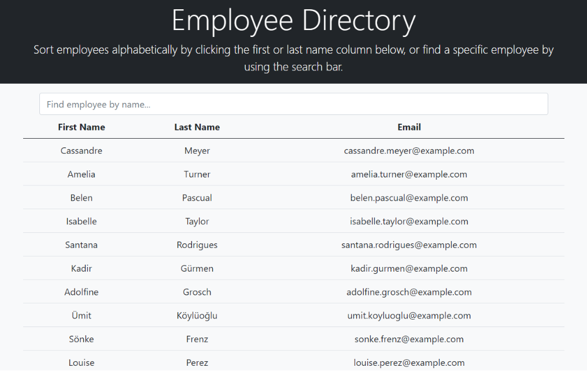

# Employee-Directory

[](License.md)

## Description

A React-based website using the [Random User API](https://randomuser.me/) that will display a list of users/employees (however you'd like to call them!). Email, first, and last names will be displayed in a table. Each table column can be sorted alphabetically, and there is a search bar at the top to find a name directly.

## Deployed Application

https://nathanjamis.github.io/Employee-Directory/

## Installation

In the console, run ```npm i``` to install necessary dependencies

## Screenshot


 
## License

MIT

## Questions

For any questions, please contact me by email or through my GitHub page
* [jamis.walsh@gmail.com](mailto:jamis.walsh@gmail.com)
* [NathanJamis](https://github.com/NathanJamis)
